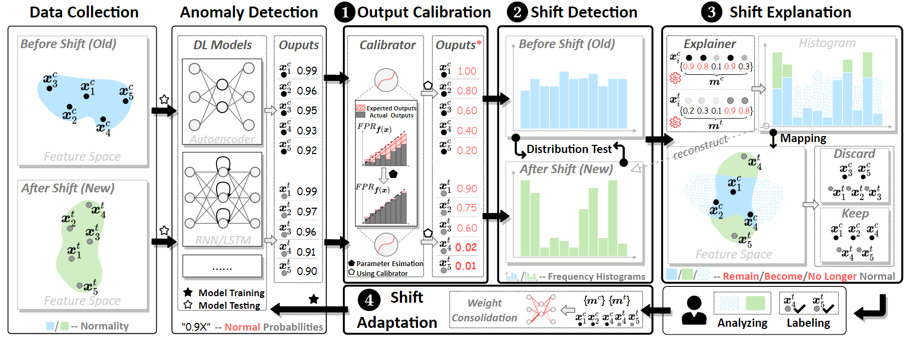

> *Anomaly Detection in the Open World: Normality Shift Detection, Explanation, and Adaptation. Accpeted by [NDSS'23](https://www.ndss-symposium.org/ndss2023/).*
---

**OWAD** aims to tackle distribution shift for deep learning based anomaly detection. In practical security applications, the distribution of data can differ and evolve over time. Such distribution shift can induce dramatic model peformance degradation, if not detected and properly adapted. This is an important reason why learning-based methods always perform well on validation or test set, but become extremely poor in real-world deployments.

In this context, **OWAD** is a novel framework to *detect*, *explain* and *adapt* to distribution shift. The major advantage of **OWAD** is to **reduce the overhead of manual labeling** during investigation and adaptation of shift. The overview of **OWAD** is shown in the following figure. It includes four key steps:
- Output Calibration: calibrate the model outputs to provide them a good description and get ready to distributional test in the following step;
- Shift Detetion: detect shift via distributional test of calibrated outputs;
- Shift Explanation: select important samples inducing the distribution shift;
- Shift Adaptation: subtly retrain model with important samples to adapt to the shift.

(More details can be found in our paper.) 

# Environment Setup

# Use Cases
We provide several cases to show how to use **OWAD** on different use cases (different applications, models, and datasets):

- [(Normal-Confidence Anomaly Detection) LSTM, Log Anomaly Detection, BGL](demo/LogAD_LSTM_BGL.ipynb)
- [(Abnormal-Confidence Anomaly Detection) Auto-Encoder, NIDS, Kyoto-2006](demo/NIDS_KitNET_Kyoto.ipynb)
- 

# Citation

# More Info and Notes

- Regarding the baselines and open datasets used in our experiments in Section V. ("EVALUATION"), their available links are as follows

  - (Datasets for NID) Anoshift: https://github.com/bit-ml/AnoShift; Kyoto-2016: https://www.takakura.com/Kyoto_data/ 
  - (Datasets for LogAD) BGL: https://doi.org/10.5281/zenodo.1144100
  - (Datasets for APT) LANL-CMSCSE: https://csr.lanl.gov/data/cyber1/
  - (Baseline) CADE: https://github.com/whyisyoung/CADE
  - (Baseline) TRANS: https://s2lab.cs.ucl.ac.uk/projects/transcend/
  - the code of Trascend/TRANS and UNLEARN are obtained offline from the authors
  
- Regarding our real-world deployment in Section VI. ("REAL-WORLD TEST ON SCADA"), the DeepLog model we used has been included in the `admodels/` folder. The data about this part is inconvenient to release (at least for now) for compliance purpose as    it involves sensitive information and privacy issue in SCADA. 

